- Anh Le - a.v.le@wustl.edu - Kien Ta - k.l.ta@wustl.edu

<h1>Starter code for Subletsgo</h1>

Run <strong>npm install</strong> on both current and backend directory to install the dependencies

Run <strong>npm start</strong> to start the app

<h1>Demo</h1>

<h2>Login/Signup page</h2>
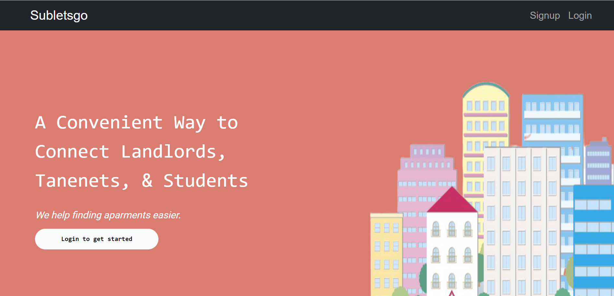
 

<h5>Login</h5>
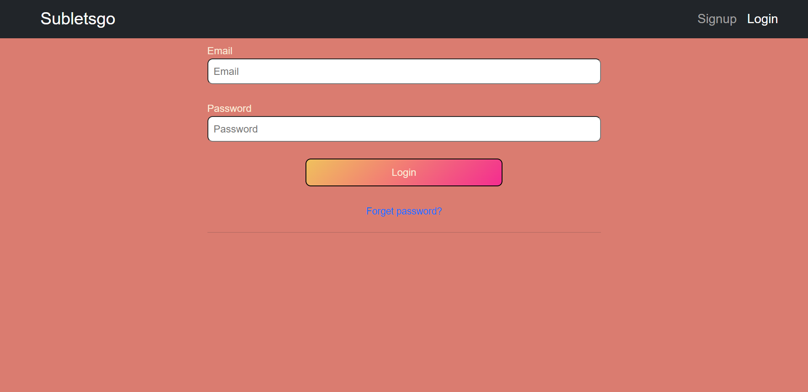

<h5>Signup</h5>
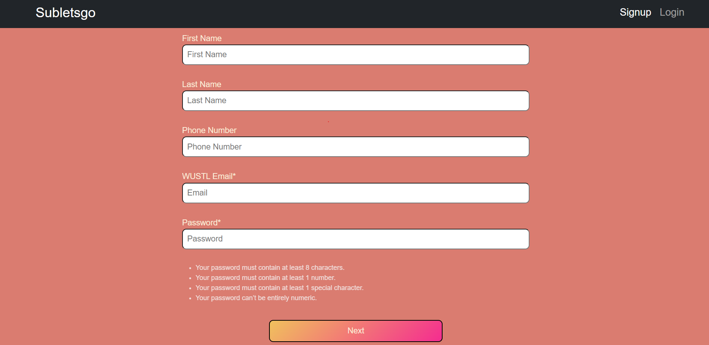

Email varification

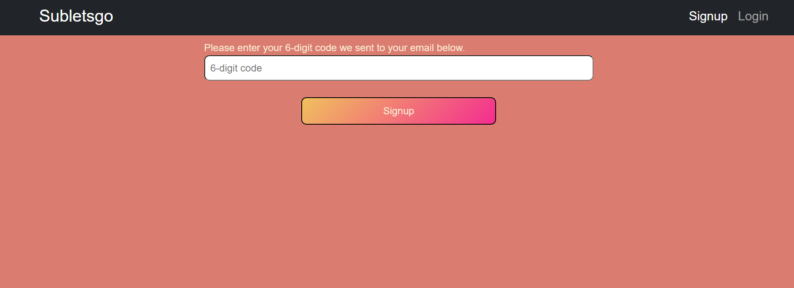

<h5>Forget Password</h5>
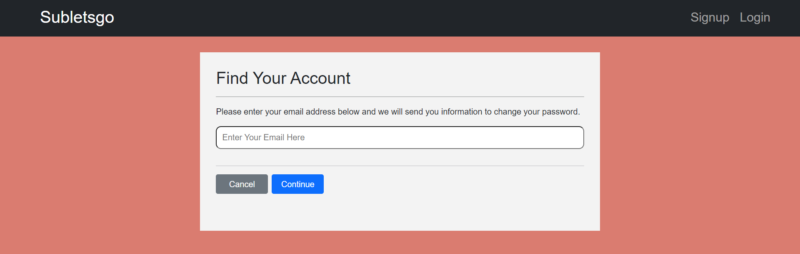

Email varification

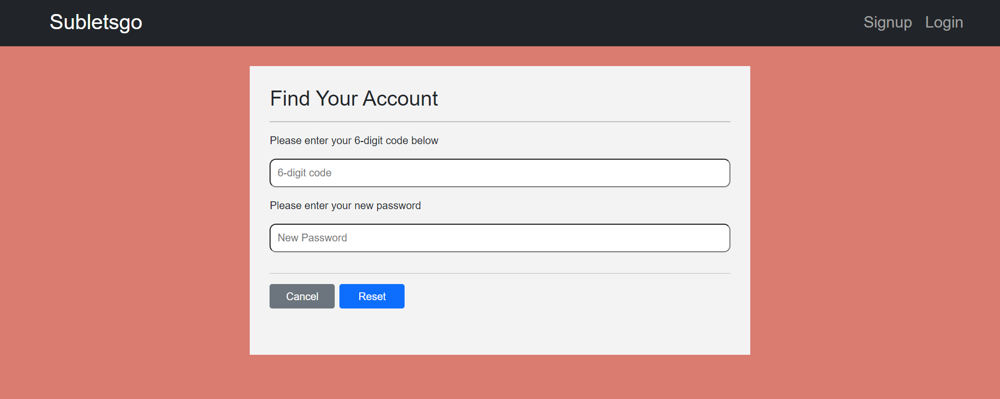

<h2>Tenant page</h2>
<h5>Homepage</h5>
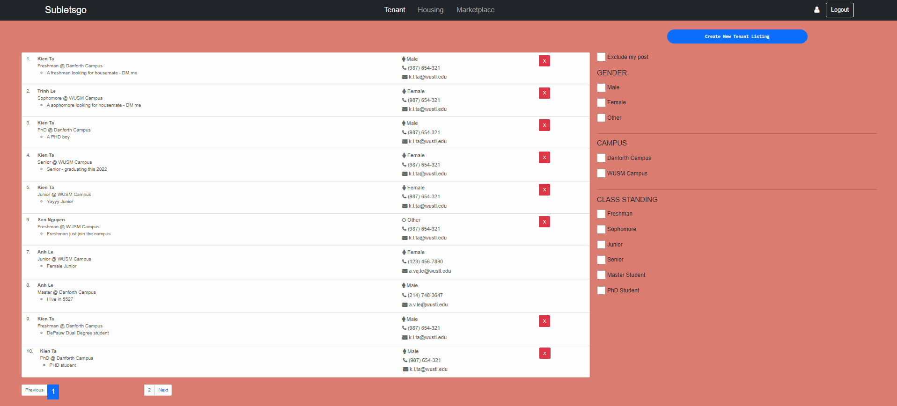
<h5>Create</h5>
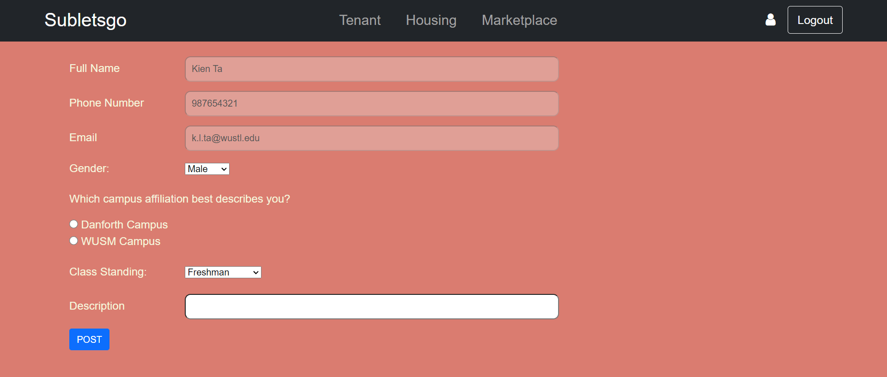
 

<h2>Housing page</h2>
<h5>Homepage</h5>
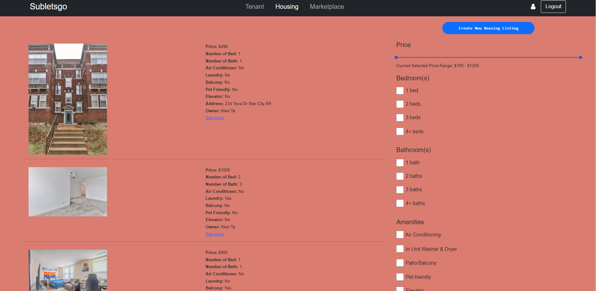
<h5>Create</h5>
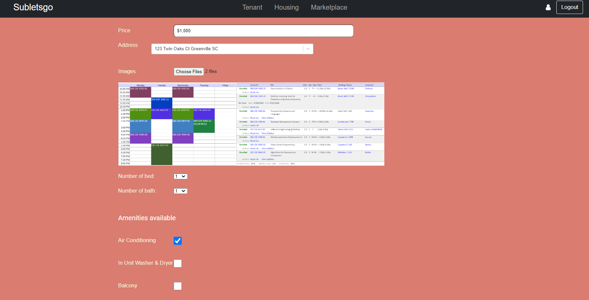
 

<h2>Marketplace page</h2>
<h5>Homepage</h5>
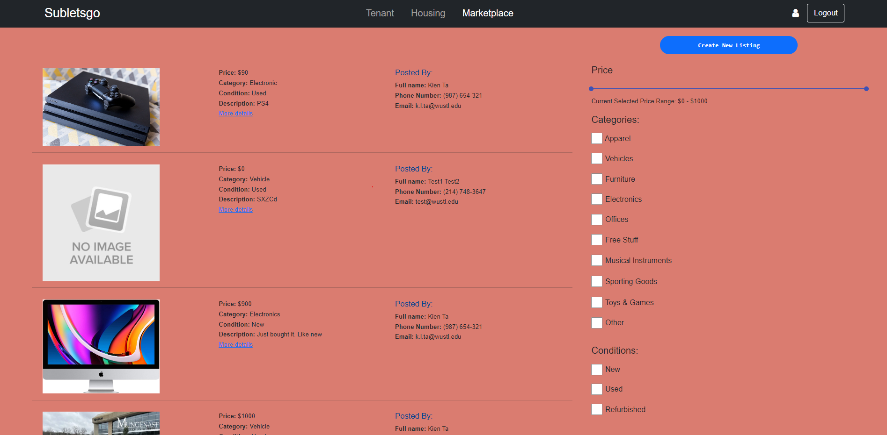
<h5>Create</h5>
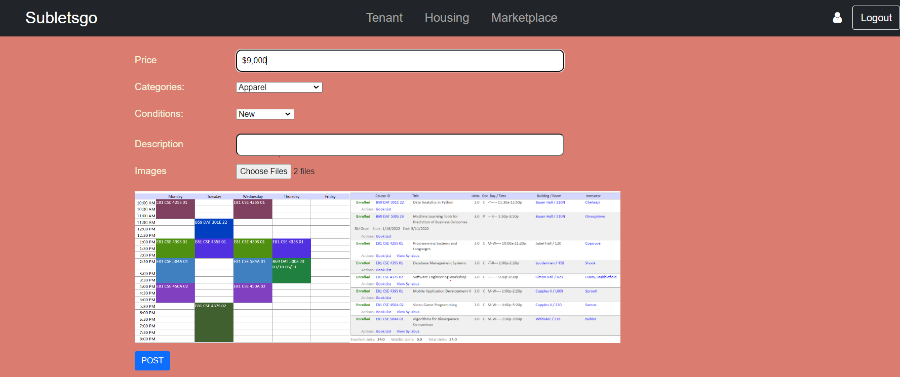
 
